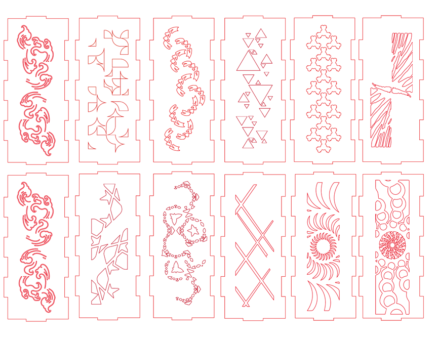
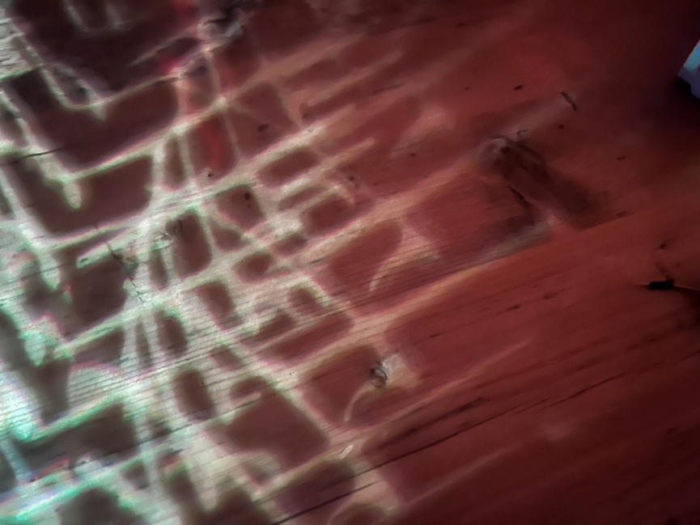

https://git.arts.ac.uk/22044483/PCOMP-Final

## Week 6: Topic
I am very interested in creating light effect interaction performance device as I always get inspirited from combination of colors and shadows.
So, when our group members says they want to create something that help people communicate, 
I immediately think of the using light as medium to create an in-direct interactive scene 
that users cooperate to trigger their own artwork of communication.  
When thinking of communication, it is a very complex connection between human being that is so emotional, 
which may not be represented by any dedicated designed patterns. So I decide to add lenses and mirrors to
diverge the lights and use gravity to create the randomness of pattern, thus will eventually somehow interpolate the complexity of relationships.  
We have the output, how about the input. After we discuss, we think heartbeat and touch is the best way.
Heartbeat is the natural signals of our body, everyone has it, and it can show the emotional change in some way. 
Meanwhile, the meaning of resonance as scientific terms is beat togethers. So we choose heartbeat as one input to represent communication.
Touch is the most common physical interactions between human beings, so we choose this to add more randomness and depict the
interactions in real life.

## Week 7: Lights
Once we set the topic, the next step the to design the light effects. The light could be beautiful but very challenging 
when we try to build it. Aside from the output led lights, how to create the complex light pattern is what we do for this week.
We tried lenses at first, because I thought that lenses will blend the light to different direction and also generate chromatic
effects when the light collides. However, the lenses we brought is too small, too expensive and too heavy to use as the context.
The effects are surprising sometimes, but mostly disappointing.   
  
Soft glass is the next material we test. The reflection effect is great but also very hard to control as the light sometimes fade when glass block the rays instead of reflect them.
  
Then we thought fo scattered glasses, the effect is great, the pattern gets more complex and beautiful, but it is too dangerous as the small pieces may fall.
  
We tested tin foil when we out of ideas, we just pick stuff we have from the kitchen, but the effect is fabulous!
  
Then our team members tested colorful candy and cellophane, and eventually decided to use cellophane and tin foil as context.

## Week 8: Structure and Pattern
This week we divide our job into 2. One focus on mechanical structure that make our instalment move. The rest of us 
focus on the look: light ball geometry and patterns. 

    
First, we tried C60 structure because we think the structure is very stable. Meanwhile, 32-faces will enable us to cut more beautiful pattern that create very fabulous effects.
But the structure is too fragile and too hard to fix to build when we use cardboard as shell.
  
We eventually chose a hard material (MDP) and an octagonal structure and used laser printing to engrave the pattern directly on it.
However, the axis connection to the light ball is not fixed, so we can change the geometry of light ball at any time we want.
  
For patterns, we have 16 faces in total for the two light balls. So we choose to put patterns in sequence as they go from abstract to figurative.
This represents the process of two people getting know each other from blur impression to clear and deep communication, which is, resonance between human.
This also represent the existence of ideas from simple feelings to cultural and meaningful relationships.
  

## Week 9: Coding and Build-Up
I am in charge of the algorithms and structure, which means I have to handle with every possible situation.
When our group member dealing with outputs, some problems occurs. The led light part went fine, but he cannot use code to 
control the stop-and-goes of the motor, he can only set the speed but don't know how tho control it. So I rewrite his code to fit
our needs. 

For the algorithm part, I use a 2D array to record the events for each user in last 10 listens, the heart beat will record as 1 and touch will record as two. If the sum of the 
events is high enough, it means that the users gets more synchronous. If one triggers effect, but the others' last 10 events is low, it means they have not reached a resonance yet.  
  
The core functions is up there. This function checks the events and return the rotation step for motor to run. You can see for different synchronous event, different steps will run.
[Video 1](move1.mp4)  
[Video 2](move2.mp4)  
[Video 3](move3.mp4)  

Because the one who was in charge of structure did not get to know some regulations of the final project. Me and Quanzhu Chen have to decompose the structure and solder and reconnect the whole structure 
at the last two days. It was very challenging to us and we have to re-build the whole structure for the final display.

For more detailed displays, please refer to the source code and our display video.

  
  
  
  
  
 