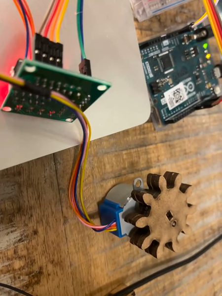

# RESONANCE
### Physical Computing Arduino Final Project
**Jiangyun Pan** 22044483  
**Quanzhu Chen** 22018321  
**Yifei Fan** 22003728  

## Introduction 
The project aims at reconstructing the human interaction in the context of an atomized and post-epidemic society and seeks the expression of the fascinating connections between human beings. We seek to interpolate complex communications between human by using the lights, lens, and shadows.   
### Structure
The instalment consist of a base box that hold the arduino and cables, two light balls build up with hard cardboard, lens and mirrors that generate light effect to indicate the communication.
## Input & Output
### Input
We have four input sensors, two of each kind.  
Two **pulse** sensor that detects heartbeat or pulse.  
Two **pressure** sensor that detects pressure input by touch.  
### Output
One **motor** that drives the rotation of axis and light balls.  
Two **LED lights** that light up the scene.
## Interaction
[Interaction Video](interaction.mp4)  
Two users will be given one pulse sensor and one pressure sensor. By detect and calculate touch and pulse frequencies, we can tell whether the users are synchronous. 
Once their heartbeat or touch meet the others, special effect of light and rotation will be triggered.
When the rotation is triggered, lens and mirrors inside the light balls will fall. 
When light effect is triggered, the color and brightness of the light will change. 
Thus, each time the light balls rotates, different effect will generate because the natural fall by gravity will cause randomness of position of the lens and mirrors.
The complex and uncertain light effect is what we used to interpolate the complex consciouses collision between human beings.
### Detail
**Touch**  
triggers light fade 

**Touch Together**  
triggers rotation for certain angle  

**Touch on Heartbeat/Getting Synchronous**   
light balls keep rotating and lights change color
## Design
### Light Effects

To get different light effects per each rotation, we tried lots of combination of inside content combinations. We tried concave and convex lenses, soft glasses, glass scatters, sugars,
but finally choose kaleidoscope as prototype. We use holes to control the shape of light and colorful cellophane and tinfoil as context to generate the hierarchical effect of chromatic and lights. 

### Geometry
**C60 Structure**  

First, we tried C60 structure because we think the structure is very stable. Meanwhile, 32-faces will enable us to cut more beautiful pattern that create very fabulous effects. 
But the structure is too fragile and too hard to fix to build when we use cardboard as shell. 

**Octagonal**

We finally chose a hard material (MDP) and an octagonal structure and used laser printing to engrave the pattern directly on it.

**Optional**  
However, the axis connection to the light ball is not fixed, so we can change the geometry of light ball at any time we want.

### Pattern

We have 16 faces in total for the two light balls. So we choose to put patterns in sequence as they go from abstract to figurative.
This represents the process of two people getting know each other from blur impression to clear and deep communication, which is, resonance between human.
This also represent the existence of ideas from simple feelings to cultural and meaningful relationships.

### Base

Step motor drives the axis and then the light balls.
## Work Division
